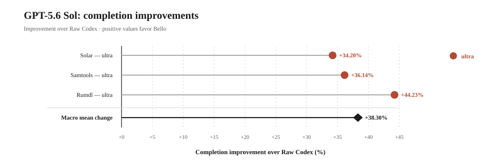
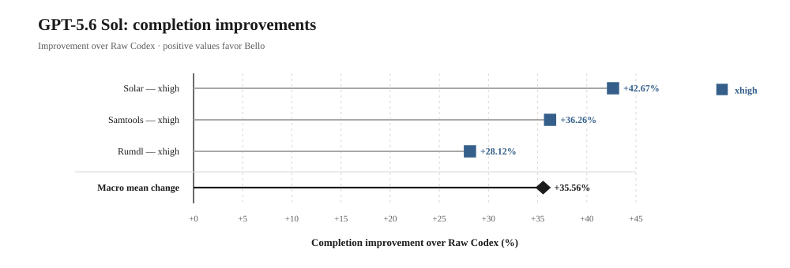
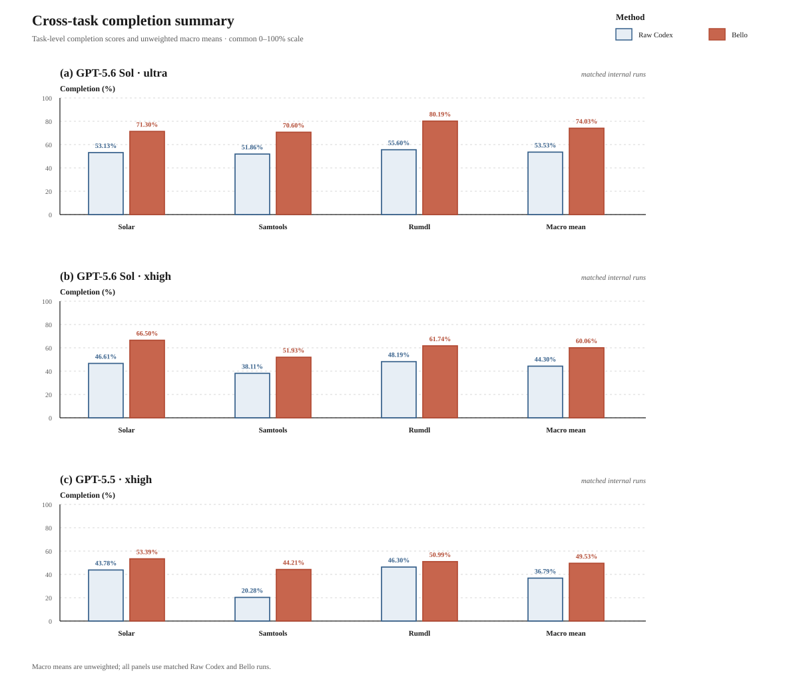
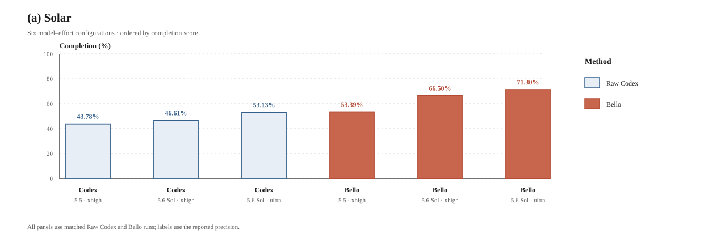
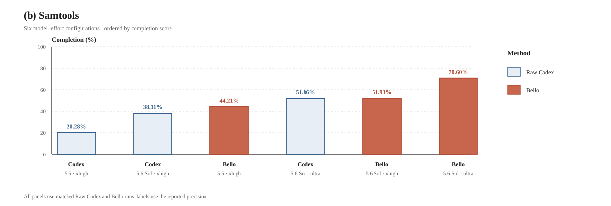
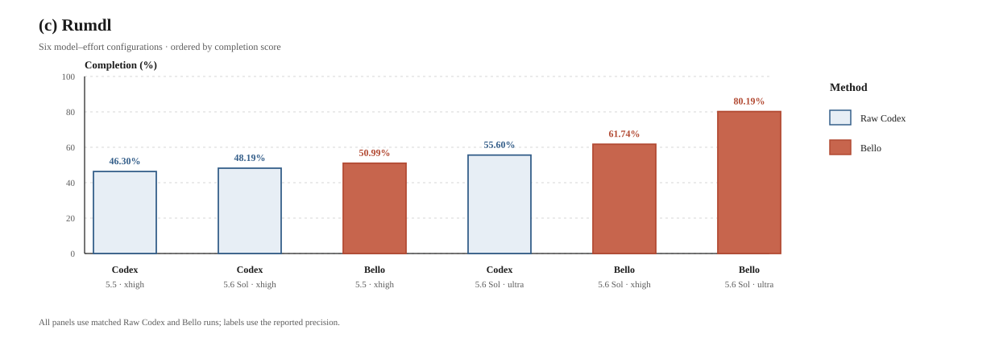

<h1 align="center">Bello</h1>

<p align="center">
  <strong>Research-backed verification, a 38% relative increase on benchmarks, and a fully autonomous system.</strong><br>
  Assign the task and walk away. Bello keeps the coder inside a disposable sandbox while an independent, fresh-context supervisor reviews risky actions, catches drift, and manages recovery. <br>
</p>

<p align="center">
  <a href="https://github.com/Makson179/Bello/actions/workflows/tests.yml"></a>
  <a href="https://www.python.org/downloads/"></a>
  <a href="./LICENSE"></a>
  
  
</p>

<p align="center">
  
</p>

## Contents

- [Motivation](#motivation)
- [How Bello solves tasks](#how-bello-solves-tasks)
- [Relationship to existing LLM research](#relationship-to-existing-llm-research)
- [Choose your supervision depth](#choose-your-supervision-depth)
- [Results](#results)
- [Requirements](#requirements)
- [Install](#install)
- [Quick start](#quick-start)
- [Configuration](#configuration)
- [Command reference](#command-reference)
- [License](#license)

---

# Motivation

Modern language models can write code, analyze documents, and solve complex problems, yet the model itself remains a generator of the next fragment of reasoning. When assigned a long, multi-stage task, it must simultaneously remember requirements, plan actions, execute them, assess its own progress, notice errors, and decide when the result can be considered complete.

Combining all these functions is unreliable. As the context grows, the model degrades very quickly and begins to hallucinate [[1]](https://aclanthology.org/2024.tacl-1.9/) [[2]](https://arxiv.org/abs/2404.06654) [[3]](https://aclanthology.org/2022.acl-long.229/) [[4]](https://aclanthology.org/2023.emnlp-main.397/). Compressing the history partly addresses the context-size problem, but it can lose a critical rule, decision, or prohibition. Meanwhile, a confident model response is not evidence that the task has actually been completed.

Bello moves the management of complex work to a level above the language model.

In our architecture, a single model is not expected to represent the entire thinking process. We treat a language model as a powerful but limited executor of cognitive operations. Planning the overall process, assigning roles, managing memory, evaluating effectiveness, and making the final decision about readiness should belong to a separate system.
Bello implements such a system: not a longer chain of reasoning from a single model, but a reproducible reasoning loop in which a solution is created, reviewed, attacked, corrected, and accepted only after independent confirmation.

## How Bello solves tasks

The process begins by building the first complete solution. The coder in the isolated sandbox analyzes the task, modifies the project, runs checks, and creates a working prototype, while an independent runtime supervisor continuously monitors the execution from a fresh context, intercepts risky actions before they happen, and steers the developer back on track when it detects drift, repeated mistakes, or unsafe behavior. If necessary, it can deny an action or restart a failing generation while preserving verified progress, keeping the run both autonomous and controlled.

The result is then passed to **completion review**. This component does not continue development or take the author's report at face value. It independently reconstructs the task's mandatory requirements and checks:

* whether the required behavior has been implemented;
* whether the checks support the claimed result;
* whether any modes or edge cases remain untested;
* whether any regressions have been introduced;
* whether fresh validation was performed after the latest substantial changes.

If a problem is found, the work returns to the developer. After the fix, a new full review is performed because a local change may affect other parts of the system.

Once the solution has passed several development and review cycles, the **adversary** is launched. Its job is not to confirm the work, but to try to break it. It explores invalid inputs, unexpected action sequences, interactions between features, boundary states, and assumptions that the developer and reviewer may have overlooked.

The adversary works independently of the solution's development history. It evaluates the final artifact, not how convincing the author's explanation is. If it finds a potential defect, the solution is sent back to completion review, which determines whether the observed behavior is a genuine violation of the requirements.

If a run ends unexpectedly after the coder has started working—for example because of a usage limit, a provider error, or the process being interrupted—Bello preserves the coder's current workspace under .supervisor/. To keep that recovery state available on the next run, leave Start over disabled (start-over: false). If a run is interrupted because of a security policy, restart it with `--start-over=false`. Enabling Start over discards previous recovery data.

Bello therefore implements the following cycle:

**build a solution → independently review completeness → fix defects → perform adversarial testing → reassess → accept the result.**

## Relationship to existing LLM research

Bello separates iterative repair from acceptance. [Is Self-Repair a Silver Bullet for Code Generation?](https://arxiv.org/abs/2306.09896) found that cost-adjusted self-repair gains were often modest, variable, or absent, and increased substantially when feedback came from a stronger model or a human. [CRITIC](https://arxiv.org/abs/2305.11738) provides the complementary result that correction is more reliable when grounded in observable feedback from external tools. Bello therefore lets the coder execute tests and repair the artifact, but does not let the authoring trajectory certify completion. Acceptance is decided by a fresh reviewer that does not modify the artifact or treat the coder's report as evidence: it reads the specification, the artifact, and the diff, and obtains its own behavioral evidence by selectively rerunning checks against the result. The diff makes that evidence harder to stage, since weakened assertions, skipped cases, substituted mocks, and deleted tests appear as changes even when the suite reports green. [StackEval](https://arxiv.org/abs/2412.05288) found that reference answers consistently improved LLM code-judging accuracy and detected no statistically significant self-preference when such references were supplied. This supports evidence-anchored review, while StackEval's one-shot setting does not establish that a fresh reviewer is an independent correctness oracle. In Bello, the use of a fresh context separates the acceptance decision from the coder's trajectory; validation remains necessary.

The adversarial stage addresses weaknesses in both fixed and model-generated tests. [EvalPlus](https://arxiv.org/abs/2305.01210) showed that the original HumanEval suites accepted substantial amounts of functionally incorrect code. [Revisit Self-Debugging with Self-Generated Tests for Code Generation](https://arxiv.org/abs/2501.12793) found that self-generated tests can produce biased and misleading repair signals. Taken together, the previously mentioned studies and the 2026 preprint [AdverMCTS](https://arxiv.org/abs/2604.10449) provide the closest evidence for Bello's attacker role; in AdverMCTS, targeted corner cases reduced pseudo-correctness caused by sparse static tests in its programming-problem setting. Bello accordingly separates implementation, counterexample generation, and adjudication. The adversary searches beyond the existing suite, but its tests are candidate evidence rather than ground truth; the completion reviewer decides whether a finding violates the specification, and relevant edits invalidate earlier acceptance evidence.

The [AgentCoder](https://arxiv.org/abs/2312.13010) preprint is the closest prior architecture: it separates a programmer, an implementation-independent test designer, and a test executor, and its ablations support separating test construction from code generation. Its evaluation is limited to function-level synthesis and completion when generated tests pass. It therefore supports Bello's role separation without covering long-running runtime supervision, a separate completion gate, adversarial adjudication, or restart state. These additional controls target failures identified by [MAST](https://arxiv.org/abs/2503.13657) across more than 1,600 multi-agent traces, including role violations, history loss, task derailment, premature termination, and absent or incorrect verification. Bello maps them to fixed role contracts, durable handoffs, live drift detection, explicit stage transitions, and a separate final acceptance decision. Multi-agent specialization is prior art; Bello's architectural claim concerns the governance and evidence requirements imposed around the roles.

Finally, [CaMeL](https://arxiv.org/abs/2503.18813) demonstrates a prompt-injection defense in which trusted control flow and security policy are enforced by a protective system layer rather than delegated to model compliance. Bello applies the same principle through isolated execution, mediated actions, live runtime supervision, and fail-closed approvals, without claiming CaMeL's capability model or formal guarantees.

## Choose your supervision depth

Bello can be used as a lightweight safety layer or as a full quality pipeline.
In the schedules below, `C` is an independent **completion review** and `A` is
an **adversarial pass**. Runtime supervision remains active in every mode.

| Mode | Best for | What you get |
| --- | --- | --- |
| `runtime-only` | Everyday autonomous work | Spots when the coder takes a wrong turn and steers the run back toward the task. |
| `C+A` | High-quality work on a practical budget | Captures 69% of the full schedule's gain while keeping every runtime safeguard. |
| `4C+A+2C` | Flagship, high-stakes work | The deepest review schedule, delivering about 40% higher benchmark completion than Raw Codex. |

### `runtime-only` — protect the run

The coder works normally while a clean-context supervisor watches the live
trajectory. It can stop abrupt, irreversible actions—such as dropping a
database—and redirect a coder that has drifted away from the task. In our
tests, this avoided rare but potentially fatal failures while costing about
the same as Raw Codex on average, sometimes substantially less, and improving
mean completion by roughly 2%.

### `C+A` — concentrate the quality gain

This schedule adds one independent completion review followed by an
adversarial attempt to break the result. It retains all `runtime-only`
protections and captured **69% of the improvement** delivered by
the full `4C+A+2C` schedule in our shorter-run comparison. It is the balanced
choice when material defects matter but the flagship schedule would be
excessive.

### `4C+A+2C` — maximize confidence

Four completion-review opportunities refine the implementation before the
adversary probes its assumptions; two further reviews resolve what the attack
uncovers. This is Bello's flagship schedule for demanding, high-stakes work.
Across the reported benchmarks it improved completion by roughly **40% over
Raw Codex**, prioritizing coverage and confidence over elapsed time.

Configure these schedules with `bello config`. For `runtime-only`, set
`completion-review` and `adversary` to `false`. For `C+A`, enable both and
set `max-reviews-before-adversary`, `max-adversary-runs`, and
`max-reviews-after-adversary` to `1`, `1`, and `0`; use `4`, `1`, and `2` for
`4C+A+2C`. The fields, defaults, and one-run CLI overrides are documented in
the [Configuration section](#configuration).

## Results

### 1. `runtime-only` — low-cost protection

On the three ProgramBench tasks—Solar, Samtools, and Rumdl—`runtime-only`
improved average completion by approximately **2%** over Raw Codex. The larger
benefit is risk control: a fresh supervisor can catch a dangerous action or a
bad trajectory before it becomes an unrecoverable final result, without the
cost of scheduled completion-review and adversary rounds.

We also tested `runtime-only` on
[three custom tasks](https://drive.google.com/drive/u/1/folders/1eLut349Wu_uxw59H6u87cuWNRqYb3x7x)
designed to resemble ordinary work rather than polished benchmark prompts.
**Their briefs are deliberately incomplete, awkward, and uneven—the way a
task is often described by a normal colleague at work.**

| Task | Raw Codex score | `runtime-only` score | Difference | Raw Codex time | `runtime-only` time |
| --- | ---: | ---: | ---: | ---: | ---: |
| Marl | 32.91% | **37.91%** | **+5.00 pp** | 00:58:49 | 00:46:09 |
| Slab | 81.08% | **85.69%** | **+4.61 pp** | 00:57:26 | 01:04:11 |
| Pinch | 89.25% | **98.00%** | **+8.75 pp** | 00:40:09 | 00:43:34 |


*Figure R1. Comparable 0–100 evaluator scores for Marl, Slab, and Pinch. These
are separate task-specific measures, not components of a pooled benchmark.*

The [linked](https://drive.google.com/drive/u/1/folders/1eLut349Wu_uxw59H6u87cuWNRqYb3x7x)
folder contains the complete task briefs, tests, evaluator outputs, and result
artifacts.

### 2. `C+A` — a shorter quality–efficiency balance

With GPT-5.6 Sol at `ultra`, C+A raised the unweighted macro completion score
from **53.53% to 67.67%**: **+14.14 percentage points** (**+26.41% relative**).
The three-task runtime was **07:08:06**, compared with **03:39:22** for Raw
Codex. The corresponding rows are available in the
[C+A run-level data](./programbench_ca_run_info.csv).
The corresponding Bello solutions are available in the
[C+A solution artifacts folder](https://drive.google.com/drive/u/1/folders/1oWR5v3fziEZj1PkQ8xDyq5JBRCUPf5gV).

| Task | Raw Codex completion | C+A completion | Difference (pp) | Relative change | Raw Codex time | C+A time |
| --- | ---: | ---: | ---: | ---: | ---: | ---: |
| Solar | 53.13% | **59.00%** | **+5.87** | +11.05% | 00:42:16 | 02:17:45 |
| Samtools | 51.86% | **63.00%** | **+11.14** | +21.48% | 00:47:07 | 02:14:40 |
| Rumdl | 55.60% | **81.00%** | **+25.40** | +45.68% | 02:09:59 | 02:35:41 |
| **Macro mean / total time** | 53.53% | **67.67%** | **+14.14** | **+26.41%** | **03:39:22** | **07:08:06** |


*Figure C1. ProgramBench completion and runtime for the three matched GPT-5.6
Sol `ultra` task configurations.*

### 3. `4C+A+2C` — flagship quality

#### Key findings

- Across all three tasks and model–effort settings, Bello achieved the higher
  completion score in **9 of 9 matched configurations**. The overall unweighted
  mean increased from **44.87% to 61.21%**: **+16.33 percentage points**
  (+36.40% relative).
- With GPT-5.6 Sol, Bello achieved the higher completion score in **6 of 6
  matched configurations**. The unweighted mean increased from **48.92% to
  67.04%**: **+18.13 percentage points** (+37.06% relative).
- In the complete GPT-5.6 Sol `ultra` comparison, every task improved by
  **18.17–24.59 points**, and the macro average increased from **53.53% to 74.03%**.
- With GPT-5.5 `xhigh`, Bello scored higher on all three tasks; the macro
  average increased from **36.79% to 49.53%**: **+12.74 percentage points**
  (+34.64% relative).

#### Evaluation protocol

We evaluated Bello on three ProgramBench tasks: **Solar**, **Samtools**, and
**Rumdl**. Raw Codex and Bello were observed on every task with GPT-5.6 Sol in
both `ultra` and `xhigh` modes and with GPT-5.5 in `xhigh` mode. We report the
completion score recorded in the `completion_pct` field and time from the
`runtime` field of the [run-level data](./programbench_run_info.csv).
Completion scores are rounded to the nearest hundredth of a percentage point.
Runtime was not held constant, so the comparison is not compute matched.
The final solution patches for all nine reported Bello runs, together with
SHA-256 checksums, are available in the
[public evaluation artifacts folder](https://drive.google.com/drive/folders/1MSyxidKXeQz7DA0gKn6KJtcWmefFu2-D?usp=share_link).

#### GPT-5.6 Sol

##### `ultra`

| Task | Raw Codex completion | Bello completion | Difference (pp) | Relative change | Raw Codex time | Bello time |
| --- | ---: | ---: | ---: | ---: | ---: | ---: |
| Solar | 53.13% | **71.30%** | **+18.17** | +34.20% | 00:42:16 | 07:39:17 |
| Samtools | 51.86% | **70.60%** | **+18.74** | +36.14% | 00:47:07 | 19:25:22 |
| Rumdl | 55.60% | **80.19%** | **+24.59** | +44.23% | 02:09:59 | 07:44:12 |
| **Macro mean / total time** | 53.53% | **74.03%** | **+20.50** | **+38.30%** | **03:39:22** | **34:48:51** |

*Bold completion values indicate the higher observed score within each matched
row.*

Across the three matched `ultra` runs, Bello increased completion by
18.17–24.59 percentage points on every task. The unweighted macro average rose
from 53.53% to 74.03%, a gain of 20.50 points (38.30% relative).



*Figure 1a. Bello-minus-Raw completion differences for the three GPT-5.6 Sol
`ultra` configurations. Every point lies to the right of zero; the diamond
shows the unweighted mean difference (+20.50 points). Uncertainty intervals are
not shown because each configuration has one observation.*

##### `xhigh`

| Task | Raw Codex completion | Bello completion | Difference (pp) | Relative change | Raw Codex time | Bello time |
| --- | ---: | ---: | ---: | ---: | ---: | ---: |
| Solar | 46.61% | **66.50%** | **+19.89** | +42.67% | 00:22:02 | 04:26:04 |
| Samtools | 38.11% | **51.93%** | **+13.82** | +36.26% | 00:37:24 | 05:39:13 |
| Rumdl | 48.19% | **61.74%** | **+13.55** | +28.12% | 00:41:30 | 03:53:35 |
| **Macro mean / total time** | 44.30% | **60.06%** | **+15.75** | **+35.56%** | **01:40:56** | **13:58:52** |

*Bold completion values indicate the higher observed score within each matched
row.*

All three `xhigh` tasks improved. The gains ranged from 13.55 to 19.89 percentage
points, and the unweighted macro average increased from 44.30% to 60.06%
(+15.75 points, +35.56% relative).



*Figure 1b. Bello-minus-Raw completion differences for the three GPT-5.6 Sol
`xhigh` configurations. Every point lies to the right of zero; the diamond
shows the unweighted mean difference (+15.75 points). Uncertainty intervals are
not shown because each configuration has one observation.*

#### GPT-5.5

##### `xhigh`

| Task | Raw Codex completion | Bello completion | Difference (pp) | Relative change | Raw Codex time | Bello time |
| --- | ---: | ---: | ---: | ---: | ---: | ---: |
| Solar | 43.78% | **53.39%** | **+9.61** | +21.95% | 00:21:22 | 01:29:35 |
| Samtools | 20.28% | **44.21%** | **+23.93** | +118.00% | 00:21:23 | 02:30:01 |
| Rumdl | 46.30% | **50.99%** | **+4.69** | +10.13% | 00:33:50 | 03:30:01 |
| **Macro mean / total time** | 36.79% | **49.53%** | **+12.74** | **+34.64%** | **01:16:35** | **07:29:37** |

*Bold completion values indicate the higher observed score within each matched
row.*

Bello's score was higher on all three tasks. The task-level differences ranged
from 4.69 to 23.93 percentage points; the unweighted macro average increased
from 36.79% to 49.53%, a gain of 12.74 points (34.64% relative).

#### Cross-task completion summary



*Figure 2. Cross-task completion summary on a common 0–100% scale. Panels
(a), (b), and (c) show the matched GPT-5.6 Sol `ultra`, GPT-5.6 Sol `xhigh`,
and GPT-5.5 `xhigh` comparisons. The unweighted macro differences are +20.50,
+15.75, and +12.74 percentage points, respectively.*

#### Task-level configuration profiles

The following panels compare all three complete three-task configurations:
GPT-5.5 `xhigh`, GPT-5.6 Sol `xhigh`, and GPT-5.6 Sol `ultra`. Each panel
contains exactly six bars (Raw Codex and Bello for each model–effort setting),
ordered by increasing completion score. Bello precedes Raw Codex when scores
are tied. Ordering is descriptive and does not imply compute equivalence.



*Figure 3a. Solar completion scores for the six model–effort configurations,
sorted from lowest to highest. The two formerly tied values are shown at their
available precision: Codex GPT-5.6 Sol `ultra` at 53.13% and Bello GPT-5.5
`xhigh` at 53.39%.*



*Figure 3b. Samtools completion scores for the six model–effort
configurations, sorted from lowest to highest.*



*Figure 3c. Rumdl completion scores for the six model–effort
configurations, sorted from lowest to highest.*

## Requirements

- **Codex CLI** installed and authenticated (Bello drives
  `codex app-server`; your Codex account provides the models).
- **Python 3.11+** and **git**.
- macOS or Linux.

Verify your environment at any time with `bello doctor`.

## Install

**Option A: Codex plugin** (recommended if you work inside Codex):

```bash
pipx install bello
codex plugin marketplace add AlexeyKulaev/Bello-codex-marketplace --ref main
codex plugin add bello@bello-marketplace
```

Then open Codex in your project folder and ask it to run Bello on your task
file. The plugin checks for updates and launches the run for you.

**Option B: standalone CLI**

```bash
pipx install bello
bello doctor
```

Bello checks for updates at startup and offers to install them; run
`bello update` to update explicitly.

## Quick start

```bash
cd your-project
echo "Build a CLI tool that ..." > task.md
bello --task task.md
```

That's it. Bello starts the coder, supervises the run, and writes
`.supervisor/FINAL_REPORT.md` when it finishes: status, changed files,
validations that were run, and remaining risks.

While a run is active you can type into the terminal; your message is routed
to the supervisor, not the coder:

| Control | Action |
| --- | --- |
| `/status` | Show task, generation, active turn, pending approvals, health. |
| `/pause` / `/resume` | Pause and resume the autonomous loop. |
| `/restart` | Request a supervised restart. |
| `/quit` | Write state and exit. |
| any text | Delivered to the supervisor as an instruction or constraint. |

Everything the run does is written to inspectable files under `.supervisor/`
in your project: `PROGRESS.md` (what has happened), `DECISIONS.md` (standing
decisions), `HANDOFF.md` (restart context), `events.jsonl` (full event
stream), and `FINAL_REPORT.md` (the result).

## Configuration

Open the interactive editor from your project folder:

```bash
bello config
```

It creates and edits `.supervisor/config.json`. Every value is saved as you
press Enter; future runs in this folder use these settings automatically.

The editor starts in Everyday mode for a new project and only shows settings
that can affect the selected pipeline. Turning on `completion-review` reveals
the completion reviewer and review budget. Turning on `adversary` then reveals
the adversary model and the complete `C+A` schedule.

For each visible role, select GPT-5.6 and then choose Sol, Terra, or Luna in
the variant row. Sol and Terra support reasoning effort from `low` through
`ultra`; Luna supports `low` through `max`. Active primary roles default to
GPT-5.6 Sol at `xhigh`; cheap runtime triage uses Luna.

CLI flags override their corresponding saved settings for one run and never
rewrite the project config. Settings without a CLI flag, including cheap
runtime and review budgets, are changed through `bello config`.

| Setting | Default | What it does |
| --- | --- | --- |
| `task` | absent | Default task file for this folder. When set, plain `bello` runs it; `--task` always overrides. |
| `coder-mod` | GPT-5.6 | Model family for the coder thread. |
| `coder-5.6-variant` | Sol | GPT-5.6 variant for the coder: Sol, Terra, or Luna. |
| `coder-intelligence` | `xhigh` | Coder reasoning effort, limited by the selected variant. |
| `runtime-mod` | GPT-5.6 | Model family for fresh-context runtime checks, including risky-action judgment and drift detection. |
| `runtime-5.6-variant` | Sol | GPT-5.6 variant for the full runtime supervisor. |
| `runtime-intelligence` | `xhigh` | Full runtime supervisor reasoning effort. |
| `completion-mod` | GPT-5.6 | Model family for the independent read-only completion reviewer. Hidden in Everyday mode. |
| `completion-5.6-variant` | Sol | GPT-5.6 variant for completion review. Hidden in Everyday mode. |
| `completion-intelligence` | `xhigh` | Completion reviewer reasoning effort. Hidden in Everyday mode. |
| `adversary-mod` | GPT-5.6 | Adversarial tester model family. Visible only when the adversary is enabled. |
| `adversary-5.6-variant` | Sol | GPT-5.6 variant for the adversary. Visible only when the adversary is enabled. |
| `adversary-intelligence` | `xhigh` | Adversary reasoning effort. Visible only when the adversary is enabled. |
| `speed` | `usual` | `fast` uses the Codex Fast service tier for coder, runtime-supervisor, and completion-review turns. Adversary turns are unchanged. |
| `cheap-runtime` | `true` | Let Luna dismiss routine runtime checks before invoking the full runtime supervisor. Human messages, approvals, and mandatory checks bypass triage. |
| `start-over` | `true` | `true` removes prior Bello logs, archived runs, and recovery data; `false` preserves them. Both start fresh active state and leave project files unchanged. |
| `completion-review` | `false` | `false` is Everyday. `true` enables the independent completion-review loop and reveals its settings. |
| `adversary` | `false` | Enable the adversarial tester before completion. Requires completion review. |
| `max-reviews` / `max-reviews-before-adversary` | `1` | Completion-return budget. Without an adversary it is shown as `max-reviews`; with an adversary it limits returns before the first pass. An earlier accept starts the adversary immediately. `0` skips these rounds; `Unlimited` removes the cap. |
| `max-adversary-runs` | `1` | Maximum adversary passes in Deep Work. `0` disables the adversary. |
| `max-reviews-after-adversary` | `0` | Maximum additional completion-review rounds after each adversary pass. At the limit Bello starts the next pass or completes after the final one. `0` schedules none; `Unlimited` removes the cap. A candidate adversary finding is still adjudicated once. |
| `clean` | `false` | **Warning:** deletes **everything** in the folder except the task file and configured protected paths before starting. Only for disposable folders where you want a from-scratch build. |
| `protected-path` | absent | Paths the coder must never write to, such as golden tests, fixtures, or production configs. They are also preserved by `clean`. |

## Command reference

```bash
bello                 # run the configured task in the current folder
bello --task TASK.md  # run a specific task file
bello config          # open the interactive config editor
bello doctor          # check Python, git, Codex, auth, app-server support
bello update          # update Bello to the latest version
bello update --check --json  # machine-readable update status
bello --version       # installed version, latest version, update status
```

Run flags (each overrides the saved config for one run):

| Flag | Meaning |
| --- | --- |
| `--task PATH` | Task file to run. |
| `--coder-mod M` | Coder model. |
| `--runtime-mod M` | Runtime supervisor model. |
| `--completion-mod M` | Completion reviewer model. |
| `--adversary-mod M` | Adversarial tester model. |
| `--coder-intelligence V` | Coder reasoning effort. |
| `--runtime-intelligence V` | Runtime supervisor reasoning effort. |
| `--completion-intelligence V` | Completion reviewer reasoning effort. |
| `--adversary-intelligence V` | Adversarial tester reasoning effort. |
| <code>--fast[=true&#124;false]</code> | Codex Fast service tier. |
| <code>--start-over[=true&#124;false]</code> | Fresh `.supervisor/` state. |
| <code>--completion-review[=true&#124;false]</code> | Completion-review loop on/off (`false` = Everyday and disables the adversary). |
| <code>--adversary[=true&#124;false]</code> | Adversarial tester on/off. |
| `--adversary-runs N` | Adversary pass budget; `0` disables. |
| <code>--clean[=true&#124;false]</code> | **Warning:** wipe the folder except the task file and protected paths before starting. |
| `--protected-path PATH` | Protect a path from writes; repeat for multiple paths. |

Environment variables: `BELLO_SKIP_UPDATE_CHECK=1` skips the startup update
check; `BELLO_PROMPTS_FILE=/path/to/prompts.toml` points Bello at an
alternative prompt file for experiments; `BELLO_CONFIG_ANIMATIONS=0`
disables motion in the interactive config editor.

## License

Bello is released under the MIT License. See [LICENSE](./LICENSE).

Contributions require signing the project [CLA](./CLA.md); a bot will prompt
you on your first pull request, and you only sign once.
