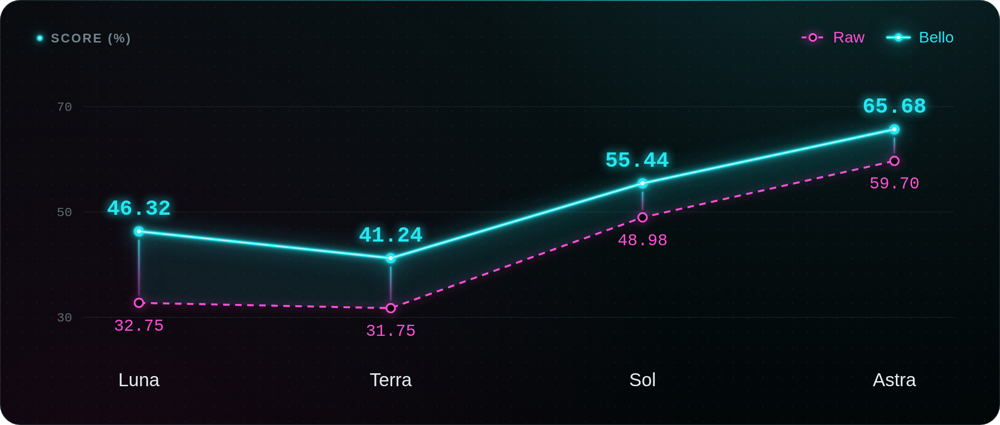
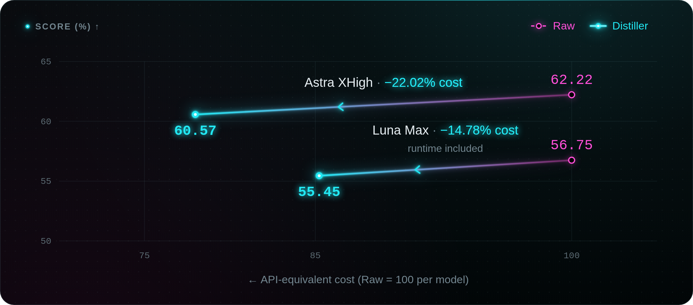
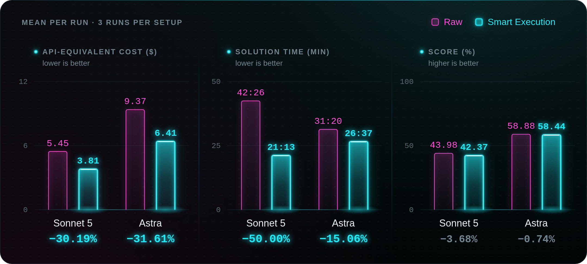
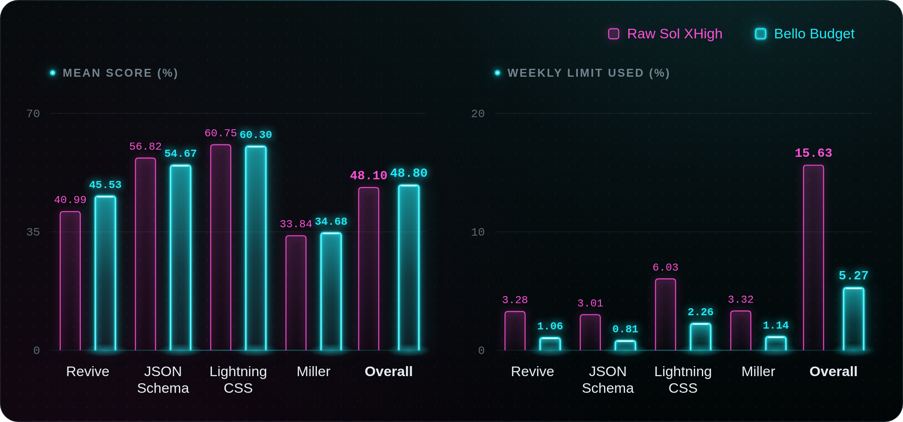
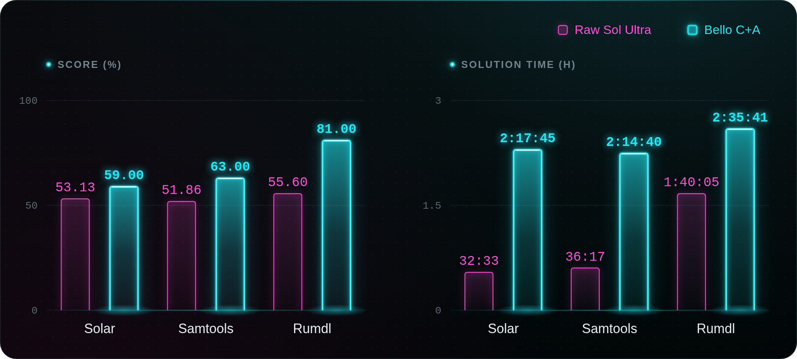
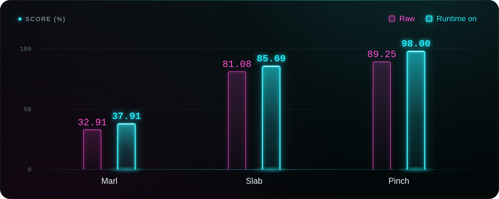

# Benchmark graphics

## Four models, with and without Bello

<picture>
  
</picture>

## Log distiller

<picture>
  
</picture>

## Smart Execution

<picture>
  
</picture>

## Budget C+A

<picture>
  
</picture>

## Sol Ultra C+A

<picture>
  
</picture>

## Runtime-only

<picture>
  
</picture>

<details>
<summary>Sources, design references, and regeneration</summary>

The README uses six supplied PNG redesigns, unchanged, on all screen sizes.
Their mapping is: eee1 → model comparison, eee2 → Smart Execution, eee3 →
Efficient Budget, eee4 → Sol Ultra C+A, eee5 → Runtime-only, eee6 → distiller.

The original SVG figures and their generator are retained as source references.
The regeneration command below rebuilds those SVGs, not the supplied PNGs:

```sh
python3 scripts/plot_readme_graphs.py
```

## Figures and sources

| Figure | Data | What the comparison means |
| --- | --- | --- |
| `readme-model-comparison` | Reported 24-run table: Luna, Terra, Sol, Astra × Solar, Samtools, rumdl × Raw/Bello | Each point is the unweighted mean of three task scores. 12 Raw + 12 Bello runs, not 24 pairs or three seeds for every task. |
| `readme-distiller` | JSON Schema Astra XHigh 3+3 and Luna Max 6+6 summaries | API-equivalent cost versus score. Raw = 100 for each model. Luna includes runtime. |
| `readme-smart-execution` | Reported Sonnet 5 and Astra RAW/SE runs, three per model and setup | Mean API-equivalent cost, solver time, and score; separate zero-based axes. Relative changes use unrounded means. All three scores per arm are included; Sonnet RAW-01 uses 888/1978 and Astra ON2 uses 1124/1978. |
| `programbench-efficient-budget-quality-cost` | Published four-task Budget comparison, 12+12 runs | Luna-based Budget C+A versus Raw Sol XHigh. Scores are means; usage is summed across three runs per task. Headline usage is summed across all twelve runs per arm. |
| `programbench-ca-performance` | [`programbench_ca_run_info.csv`](../../programbench_ca_run_info.csv) | Sol Ultra Raw versus one completion review + adversary. Not the older 4C+A+2C schedule. Score and solution time stay separate. |
| `runtime-only-custom-task-results` | Published Marl / Slab / Pinch custom-task table | Task-specific scores, not a pooled ProgramBench score. |

Published rounded aggregates are retained; do not recompute them from rounded
per-run rows. Visible value labels use two decimal places; source precision is
retained in the generator and SVG descriptions. `pp` means percentage points;
`% relative` means relative change.
No error bars, fitted curves, or confidence bands are inferred from these data.
All bar lengths start at zero. The overview is a categorical line comparison
whose score axis spans 25–72%, not a continuous model-size curve.

## Visual direction

Only metric labels, legends, axes, categories, and values appear in the figures.
The model overview uses two polylines. The distiller uses a paired cost–quality
scatter plot; connectors pair observations, not fitted trends. Its score axis
spans 50–65%, and its relative-cost axis spans 70–105. Other comparisons use
vertical columns. Raw columns are outlined blue and Bello columns are solid vermilion.
Smart Execution has three panels for cost, solver time, and score; the narrow
layout stacks them vertically. Percentage labels show changes relative to Raw.
The overview also distinguishes its series with hollow/solid markers and
dashed/solid lines. Narrow layouts stack the two-panel comparisons.

References examined for presentation, not for benchmark data:

- [METR time horizons](https://metr.org/time-horizons/): open plotting area and fine grid.
- [Epoch FrontierMath](https://epoch.ai/benchmarks/frontiermath-tier-4): direct labels and clearly separated coloured series.
- [Aider leaderboards](https://aider.chat/docs/leaderboards/): exact, readily comparable values.

No step-lines or interpolation are used: the overview connects only the four
reported categorical means. No animation is necessary to read a result.

</details>
